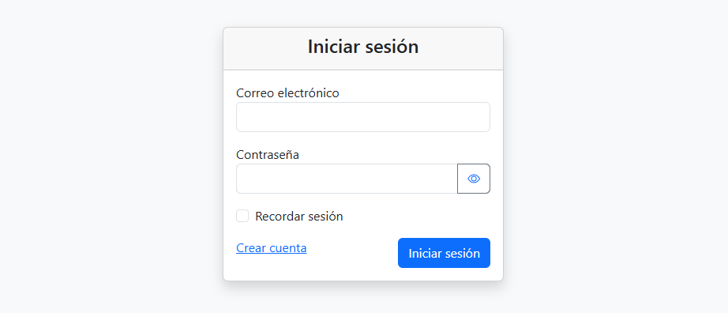
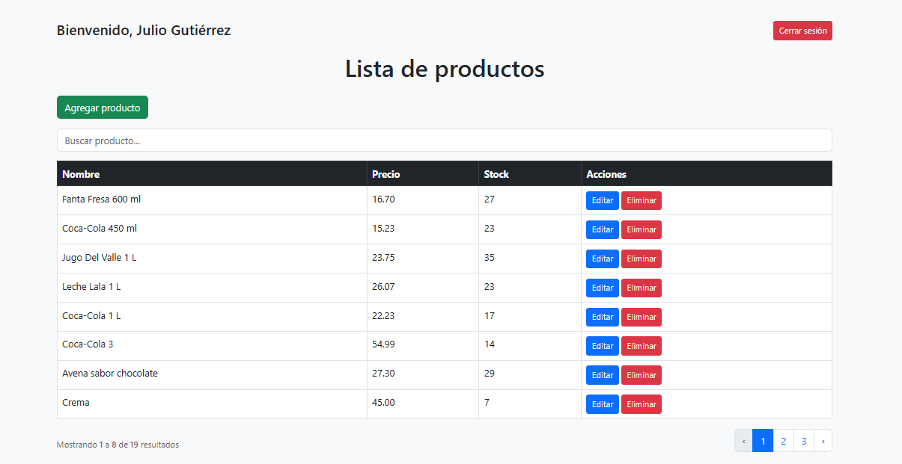
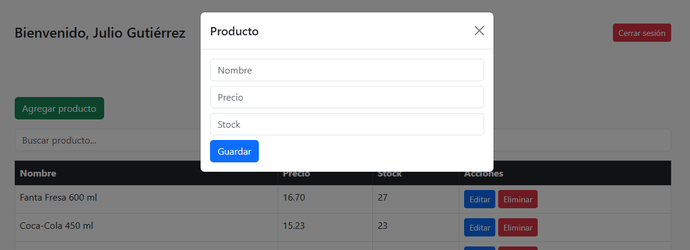
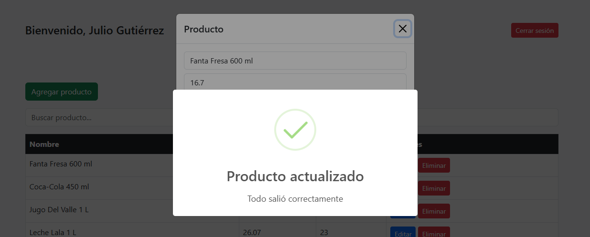
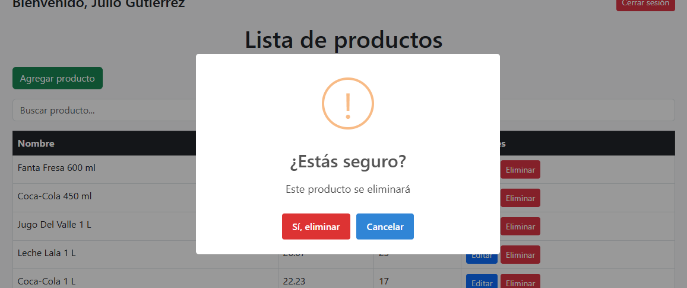

# CRUD de Productos con Laravel

Sistema web desarrollado con Laravel que permite gestionar productos mediante operaciones CRUD (Crear, Leer, Actualizar y Eliminar), incluyendo autenticación de usuarios.

---

## Características

-  Autenticación de usuarios (login y registro)
-  Listado de productos
-  Creación de nuevos productos
-  Edición de productos
-  Eliminación de productos
-  Búsqueda de productos
-  Validación de formularios

---

##  Capturas del sistema

###  Login

###  Registro

###  Lista de productos

###  Crear producto

###  Editar producto

###  Eliminar producto

---

##  Tecnologías utilizadas

- PHP
- Laravel
- MySQL
- Blade
- HTML
- CSS
- JavaScript
